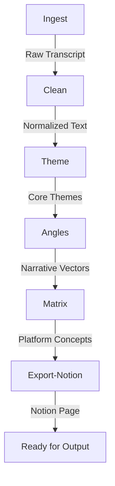

# V2 Architecture Documentation

This document outlines the stabilized architecture for the Strategic Content Extraction Engine (V2).

## 1. System Overview

The Strategic Content Extraction Engine is a high-performance pipeline designed to transform raw transcripts into structured, platform-ready content concepts. 

- **6-Step Sequential Pipeline**: Ingest → Clean → Theme → Angles → Matrix → Export-Notion.
- **Deterministic Cleaning**: Transcript normalization is handled via strict regex-based logic to preserve speaker voice without LLM hallucination or "domestication."
- **10,000 Word Boundary**: A hard server-side cap is enforced to ensure processing fidelity and prevent Notion block overflow.
- **Observational Telemetry**: Real-time telemetry monitoring for quote accuracy and voice anchoring is non-mutating and does not affect pipeline execution.
- **Resilient Export**: Dedicated retry logic for Notion API's intermittent 500 errors.

## 2. Pipeline Flow Diagram

## 3. Guardrails

### Hard Word Cap
- **Location**: `apps/api/src/index.ts` (inside `/wispr/webhook` route).
- **Enforcement**: Any transcript exceeding 10,000 words is rejected with a `400 transcript_too_large` error before LLM usage begins.

### Deterministic Cleaning
- **Location**: `apps/api/src/index.ts` (`normalizeTranscript` function).
- **Logic**: Strips timestamps, removes stuttering/fillers, and normalizes whitespace without altering the semantic meaning or tone of the speaker.

### LLM Boundaries
- LLM usage is strictly confined to the **Theme**, **Angles**, and **Matrix** steps.
- **Clean** and **Ingest** steps are 100% deterministic.

### Notion Retry Logic
- **Location**: `apps/api/src/lib/notionExport.ts`.
- **Detail**: Implements a single retry attempt with a 500ms delay if and only if the Notion API returns an HTTP 500 error during the block append process.

## 4. Known Limits

- **Optimal Length**: Recommended word count is **< 9,000 words** for best export consistency.
- **Notion Constraints**: Large transcripts may be split across multiple Notion paragraphs due to the 2,000 character limit per text block.
- **Processing Time**: Large (9K+) transcripts typically require **75–120 seconds** for full pipeline completion.

## 5. Deployment Assumptions (Local Dev)

- **API Server**: Running on `http://localhost:3001`.
- **Web Frontend**: Running on `http://localhost:3002`.
- **Infrastructure**:
    - **Supabase**: Required for data persistence and run tracking.
    - **Notion**: Valid API Token and `PARENT_PAGE_ID` required for content delivery.

---

> [!IMPORTANT]
> **This is V2 Stable.** Structural modifications to the pipeline core or prompt schemas must branch into a **V3** development cycle.
